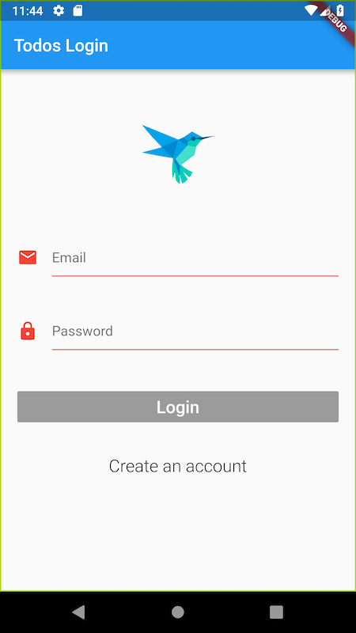
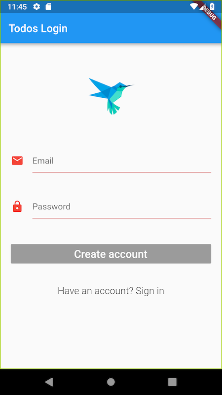
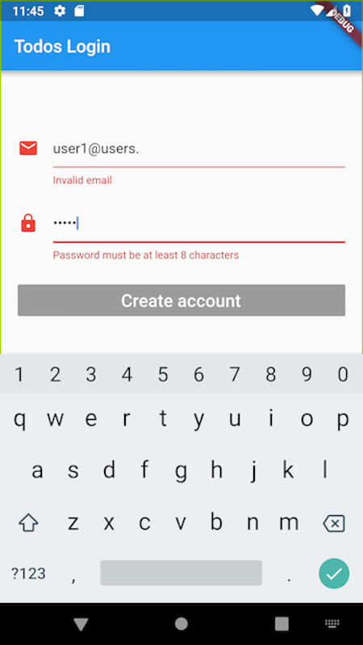
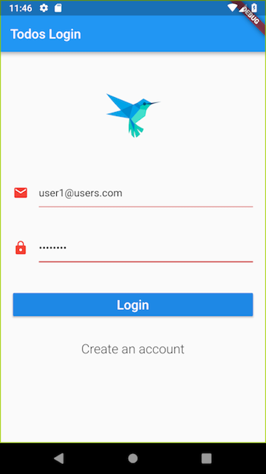
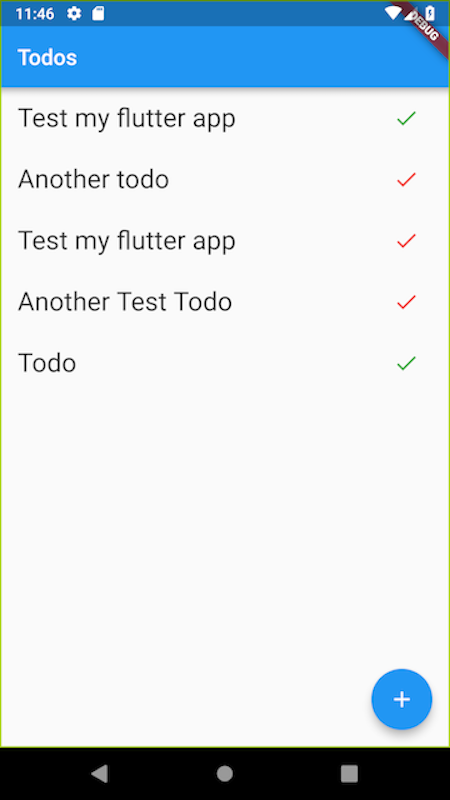
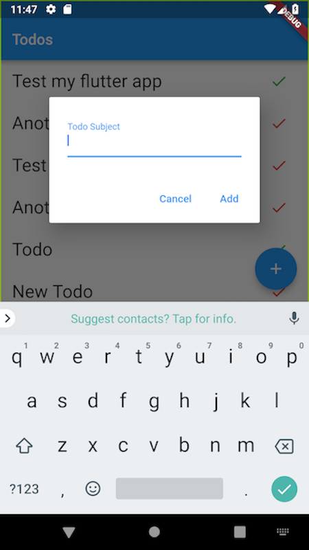

# A Flutter & Firebase Todo App

A simple application with Flutter using:
* Firebase authentication
* Firebase Realtime database

The application has 3 views: 

1. Login/Create account
2. Todos List
3. An input dialog to create todos

The app uses BLOC pattern, all logic is in the BLOC, the view passes all events the BLOC, it processes the event and redisplay the view.

## Screenshoots:

1. Signin/Signup screen: the Login is disabled if the email and password are empty or invalid. 
  

2. Signup screen: the Create account is disabled if the email and password are empty or invalid. The email and password are validated and an error message is displayed
  

3. The email and password are validated and an error message is displayed
  

4. When the email and password are valid, the login/create acount button is enabled.

5. The todos list is displayed with completed todos checked in green and uncompleted with red.

6. Todo are added to the list by clicking on +, an input dialog is displayed, if Add is clicked, the todo is added to the list.

